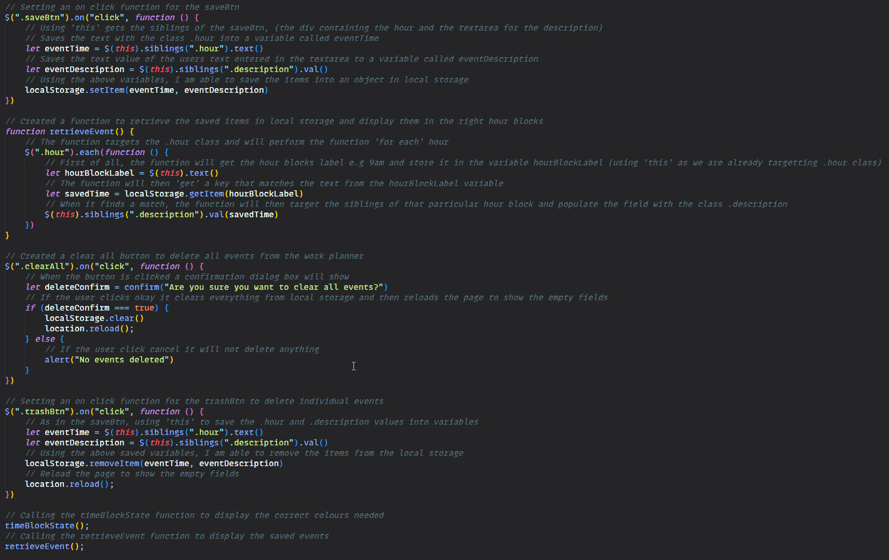

# Work Day Scheduler 

## Description
In this weeks bootcamp challenge, I was asked to create a simple Work Day Scheduler, that allowed a user to save events for each hour of the working day. I was give some basic HTML/CSS to get started and created an app that will run in the browser, featuring dynamically updated HTML and CSS powered by jQuery.

As part of the assignment, I was also required to use the [Moment.js](https://momentjs.com/) library to work with date and time.
## Acceptance Criteria

My application had to satisfy the following criteria:

```
The app should:

* Display the current day at the top of the calender when a user opens the planner.
 
* Present timeblocks for standard business hours when the user scrolls down.
 
* Color-code each timeblock based on past, present, and future when the timeblock is viewed.
 
* Allow a user to enter an event when they click a timeblock

* Save the event in local storage when the save button is clicked in that timeblock.

* Persist events between refreshes of a page
```

## Learning Points
Whilst working through this weeks challenge, I learn quite a lot about traversing the DOM. Especially how to use element siblings and using `this` within my JavaScript. As I grew in confidence I decided to add a few more features, such as being able to delete an individual event and also being able to clear all saved events. I also included a confirmation when clearing all events to make sure the user intended to do that.

In future I would love to use a modal for the confirmation dialog box instead of relying on the window confirmation. 

## Useful Information
The page is deployed on GitHub - [Click here](https://rbrd87.github.io/work-day-scheduler)

The repository of the project is also hosted on GitHub - [Click here](https://github.com/rbrd87/work-day-scheduler)

## Demo / Screenshots
Here is a demonstration of my code quiz


And here is a small snippet of my code
